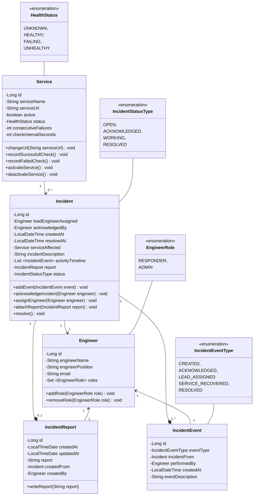

## Domain Model

### Here is my domain model

```mermaid
classDiagram
    class Service {
        -Long id
        -String serviceName
        -String serviceUrl
        -boolean active
        -HealthStatus status
        -int consecutiveFailures
        -int checkIntervalSeconds
        
        +changeUrl(String serviceUrl) void
        +recordSucessfullCheck() void
        +recordFailedCheck() void
        +activateService() void
        +deactivateService() void
    }
    
    class Engineer {
        -Long id
        -String engineerName
        -String engineerPosition
        -String email
        -Set ~EngineerRole~ roles
        
        +addRole(EngineerRole role) void
        +removeRole(EngineerRole role) void
    }
    
    class Incident {
        -Long id
        -Engineer leadEngineerAssigned
        -Engineer acknowledgedBy
        -LocalDateTime createdAt
        -LocalDateTime resolvedAt
        -Service serviceAffected
        -String incidentDescription
        -List ~IncidentEvent~ activityTimeline
        -IncidentReport report
        -IncidentStatusType status
        
        +addEvent(IncidentEvent event) void
        +acknowledgeIncident(Engineer engineer) void
        +assignEngineer(Engineer engineer) void
        +attachReport(IncidentReport report) void
        +resolve() void
    }
    
    class IncidentReport {
        -Long id
        -LocalTimeDate createdAt
        -LocalTimeDate updatedAt
        -String report
        -Incident createdFrom
        -Engineer createdBy
        
        +writeReport(String report)
    }
    
    class IncidentEvent {
        -Long id
        -IncidentEventType eventType
        -Incident incidentFrom
        -Engineer performedBy
        -LocalDateTime createdAt
        -String eventDescription
    }
    
    class IncidentEventType {
        <<enumeration>>
        CREATED,
        ACKNOWLEDGED,
        LEAD_ASSIGNED
        SERVICE_RECOVERED,
        RESOLVED
    }
    
    class IncidentStatusType {
        <<enumeration>>
        OPEN,
        ACKNOWLEDGED,
        WORKING,
        RESOLVED
    }
        
    class EngineerRole {
        <<enumeration>>
        RESPONDER,
        ADMIN
    }
    
    class HealthStatus {
        <<enumeration>>
        UNKNOWN,
        HEALTHY,
        FAILING,
        UNHEALTHY
    }
    
    %% Relationships
    Service "1"-->"0..*" Incident
    Incident "1"--*"0..1" IncidentReport
    Incident "1"--*"1..*" IncidentEvent
    Incident "1"-->"1" Engineer
    Engineer "1"<--"1" IncidentEvent
    Engineer "1"<--"1" IncidentReport
    EngineerRole -- Engineer
    IncidentStatusType -- Incident
    HealthStatus -- Service
    IncidentEventType -- IncidentEvent
```